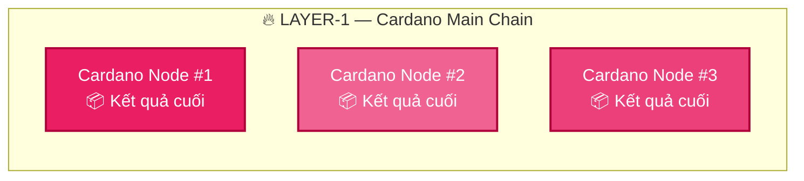

```mermaid
graph LR

    %% ===========================
    %% LAYER 1 (CARDANO MAIN CHAIN)
    %% ===========================
    subgraph L1Block ["🔥 LAYER-1 — Cardano Main Chain"]
        Main1[Cardano Node #1<br/>📦 Kết quả cuối]
        Main2[Cardano Node #2<br/>📦 Kết quả cuối]
        Main3[Cardano Node #3<br/>📦 Kết quả cuối]

        style Main1 fill:#e91e63,color:white,stroke:#b0003a,stroke-width:2px
        style Main2 fill:#f06292,color:white,stroke:#b0003a,stroke-width:2px
        style Main3 fill:#ec407a,color:white,stroke:#b0003a,stroke-width:2px
    end
```
