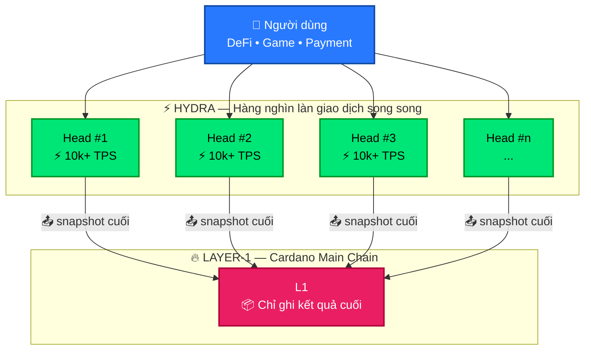

```mermaid
graph TD

    %% ===========================
    %% LAYER 1 (CARDANO MAIN CHAIN)
    %% ===========================
    subgraph L1Block ["🔥 LAYER-1 — Cardano Main Chain"]
        Main[L1<br/>📦 Chỉ ghi kết quả cuối]
        style Main fill:#e91e63,color:white,stroke:#b0003a,stroke-width:2px
    end

    %% ===========================
    %% HYDRA HEADS
    %% ===========================
    subgraph Hydra ["⚡ HYDRA — Hàng nghìn làn giao dịch song song"]
        H1[Head #1<br/>⚡ 10k+ TPS]
        H2[Head #2<br/>⚡ 10k+ TPS]
        H3[Head #3<br/>⚡ 10k+ TPS]
        Hn[Head #n<br/>...]
        style H1 fill:#00e676,color:black,stroke:#009624,stroke-width:2px
        style H2 fill:#00e676,color:black,stroke:#009624,stroke-width:2px
        style H3 fill:#00e676,color:black,stroke:#009624,stroke-width:2px
        style Hn fill:#00e676,color:black,stroke:#009624,stroke-width:2px
    end

    %% ===========================
    %% USER BLOCK
    %% ===========================
    User[👤 Người dùng<br/>DeFi • Game • Payment]
    style User fill:#2979ff,color:white,stroke:#0d47a1,stroke-width:2px

    %% ===========================
    %% FLOWS
    %% ===========================
    User --> H1
    User --> H2
    User --> H3
    User --> Hn

    H1 -->|📤 snapshot cuối| Main
    H2 -->|📤 snapshot cuối| Main
    H3 -->|📤 snapshot cuối| Main
    Hn -->|📤 snapshot cuối| Main
```
